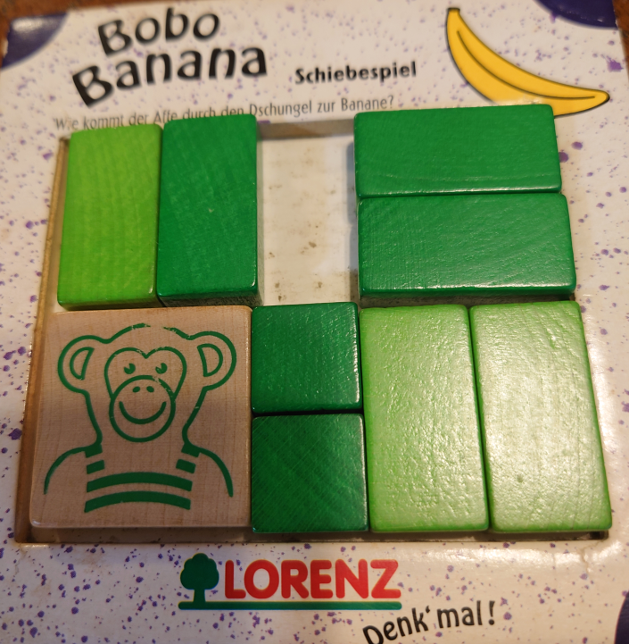
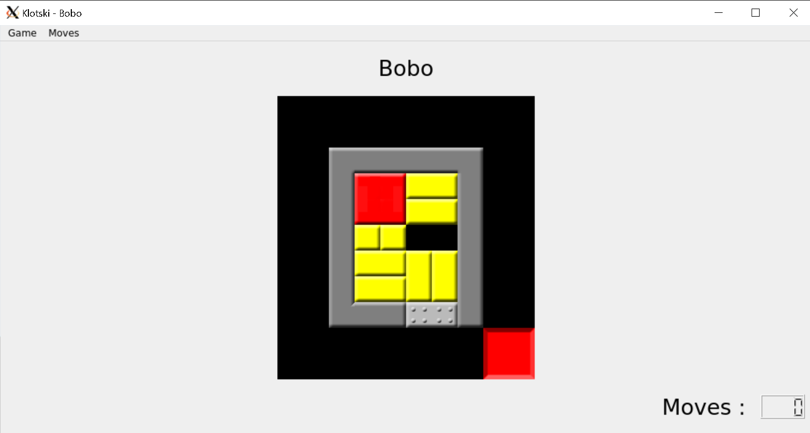

# bobo-banana

<pre>
Bobo banana (4x5 board) is one of Klontski games. The game is 
composed of 9 pieces(2x2, 1x2, 2x1, 1x1).
The goal is to move monkey (2x2) to banana by sliding pieces.
This repository shows how to create the target program using 
the existing code and modifying it with minimum efforts.

Sliding games->Klotski puzzle->github site (python)->
SlidingPuzzleSolver found

</pre>

# expand bobo.tar
$ tar xvf bobo.tar

bobo.tar has the following programs:

board_utils.py, bobo.py, klotski.py, and sliding_game.py
<pre>
The original source codes are at:
</pre>
http://github.com.https.443.262d333a6b.a.proxy1.ipv6.xiangtan.gov.cn/Recursing/SlidingPuzzleSolver.git

<pre>
Original klotski.py program was modified for bobo banana game:
4x5(horizontal x vertical) bobo banana puzzle 
vertical rectangle (2 pieces):up-down:2-3
horizontal rectangle (4 pieces):left-right:4-5
single square (2 pieces):1
monkey 2x2 (1 piece):6

bobo banana start:
        start_board=(6, 6, 4, 5,
                     6, 6, 4, 5,
                     1, 1, 0, 0,
                     4, 5, 2, 2,
                     4, 5, 3, 3),
bobo banana goal:
        goals=(18, 19),
</pre>

# How to run the program
<pre>
$ python bobo.py
Solved Red Donkey:
--------
6 6 4 5  6 6 4 5  6 6 4 5  6 6 4 5  6 6 4 5
6 6 4 5  6 6 4 5  6 6 4 5  6 6 4 5  6 6 4 5
1 1 0 0  1 0 1 0  0 1 1 0  0 1 0 1  0 0 1 1
4 5 2 2  4 5 2 2  4 5 2 2  4 5 2 2  4 5 2 2
4 5 3 3  4 5 3 3  4 5 3 3  4 5 3 3  4 5 3 3
0
--------
0 0 4 5  0 4 5 0  4 5 0 0  4 5 4 5  4 5 4 5
6 6 4 5  6 6 4 5  6 6 4 5  6 6 0 0  6 6 1 0
6 6 1 1  6 6 1 1  6 6 1 1  6 6 1 1  6 6 0 1
4 5 2 2  4 5 2 2  4 5 2 2  4 5 2 2  4 5 2 2
4 5 3 3  4 5 3 3  4 5 3 3  4 5 3 3  4 5 3 3
5
--------
4 5 4 5  4 5 4 5  4 5 4 5  4 5 4 5  4 5 4 5
6 6 1 1  6 6 1 1  6 6 1 1  6 6 1 1  6 6 1 1
6 6 0 0  6 6 2 0  6 6 2 2  6 6 2 2  6 6 2 2
4 5 2 2  4 5 3 2  4 5 3 3  4 5 3 3  4 5 3 3
4 5 3 3  4 5 0 3  4 5 0 0  0 4 5 0  0 0 4 5
10
--------
4 5 4 5  4 5 4 5  4 5 4 5  4 5 4 5  4 5 4 5
6 6 1 1  0 0 1 1  0 1 0 1  0 1 1 0  1 0 1 0
6 6 2 2  6 6 2 2  6 6 2 2  6 6 2 2  6 6 2 2
0 0 3 3  6 6 3 3  6 6 3 3  6 6 3 3  6 6 3 3
4 5 4 5  4 5 4 5  4 5 4 5  4 5 4 5  4 5 4 5
15
--------
4 5 4 5  4 5 0 0  0 4 5 0  1 4 5 0  1 4 5 0
1 1 0 0  1 1 4 5  1 1 4 5  0 1 4 5  1 0 4 5
6 6 2 2  6 6 2 2  6 6 2 2  6 6 2 2  6 6 2 2
6 6 3 3  6 6 3 3  6 6 3 3  6 6 3 3  6 6 3 3
4 5 4 5  4 5 4 5  4 5 4 5  4 5 4 5  4 5 4 5
20
--------
1 4 5 0  1 4 5 0  1 4 5 2  1 4 5 2  1 4 5 2
1 4 5 0  1 4 5 2  1 4 5 3  1 4 5 3  1 4 5 3
6 6 2 2  6 6 2 3  6 6 2 0  6 6 0 2  0 6 6 2
6 6 3 3  6 6 3 0  6 6 3 0  6 6 0 3  0 6 6 3
4 5 4 5  4 5 4 5  4 5 4 5  4 5 4 5  4 5 4 5
25
--------
1 4 5 2  0 4 5 2  4 5 0 2  4 5 0 2  4 5 0 2
0 4 5 3  1 4 5 3  1 4 5 3  1 4 5 3  0 4 5 3
1 6 6 2  1 6 6 2  1 6 6 2  0 6 6 2  1 6 6 2
0 6 6 3  0 6 6 3  0 6 6 3  1 6 6 3  1 6 6 3
4 5 4 5  4 5 4 5  4 5 4 5  4 5 4 5  4 5 4 5
30
--------
4 5 0 2  4 5 2 0  4 5 2 0  4 5 2 2  4 5 2 2
4 5 0 3  4 5 3 0  4 5 3 2  4 5 3 3  4 5 3 3
1 6 6 2  1 6 6 2  1 6 6 3  1 6 6 0  1 0 6 6
1 6 6 3  1 6 6 3  1 6 6 0  1 6 6 0  1 0 6 6
4 5 4 5  4 5 4 5  4 5 4 5  4 5 4 5  4 5 4 5
35
--------
4 5 2 2  4 5 2 2  4 5 2 2  4 5 2 2  4 5 2 2
4 5 3 3  4 5 3 3  4 5 3 3  4 5 3 3  4 5 3 3
0 1 6 6  1 1 6 6  1 1 6 6  1 1 6 6  1 1 6 6
1 0 6 6  0 0 6 6  4 5 6 6  4 5 6 6  4 5 6 6
4 5 4 5  4 5 4 5  0 0 4 5  0 4 5 0  4 5 0 0
40
--------
4 5 2 2
4 5 3 3
1 1 0 0
4 5 6 6
4 5 6 6
45
Length:  45
</pre>
# How to play Klotski games by you

<pre>
$ sudo apt-get install pyqt5-dev-tools
$ pip install klotski
$ python -m klotski

install it:
$ git clone https://github.com/bluebird75/klotski.git

add bobo in src/boards.kts file:

<Bobo>
@          @
@          @
@  ######  @
@  #**aa#  @
@  #**bb#  @
@  #cd  #  @
@  #eegh#  @
@  #ffgh#  @
@  ###--#  @
@        ..@
@        ..@
</pre>

# Exercises for students
In the original problem, Monkey's initial position is in 
the lower left corner, but in the new problem, Monkey's 
initial state is in the upper left corner.
<pre>
Hints:
In order to change the problem, you must modify klotski.py. 
start_board (4x5) is represented as follows:
        start_board=(6, 6, 4, 5,
                     6, 6, 4, 5,
                     1, 1, 0, 0,
                     4, 5, 2, 2,
                     4, 5, 3, 3),
where 1 represents a single square, (2,3) is a vertical rectangle, (4,5) is a 
horizontal rectanble, four 6's can represent a Monkey, and 0 is an empty space.
</pre>
